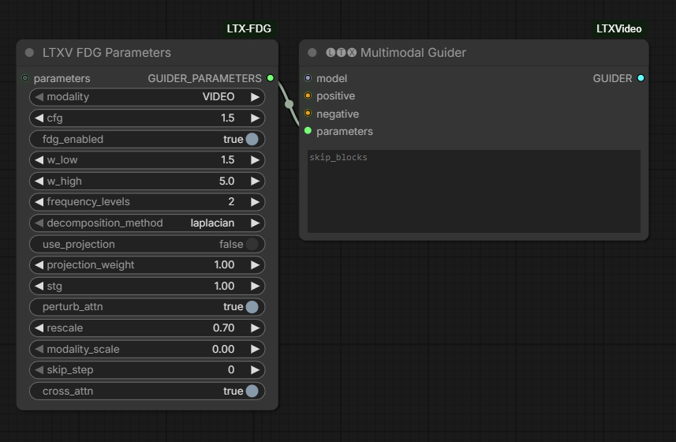

# ComfyUI-LTX-FDG

Frequency-Decoupled Guidance (FDG) for ComfyUI and ComfyUI-LTXVideo.

Credit to [dorpxam](https://github.com/dorpxam) for bringing it up.

He might have more tested version soon [https://github.com/AkaneTendo25/musubi-tuner/issues/40#issuecomment-4033048905](https://github.com/AkaneTendo25/musubi-tuner/issues/40#issuecomment-4033048905)

Vibecoded based on the paper:
> **"Guidance in the Frequency Domain Enables High-Fidelity Sampling at Low CFG Scales"**
> https://arxiv.org/abs/2506.19713



## What is FDG?

FDG improves upon standard Classifier-Free Guidance (CFG) by applying **separate guidance scales** to different frequency components:

- **Low-frequency guidance (`w_low`)**: Controls global structure, composition, and color
  - Lower values preserve diversity and prevent oversaturation
  - Higher values improve condition alignment

- **High-frequency guidance (`w_high`)**: Enhances visual fidelity, details, and sharpness
  - Can use higher values without the drawbacks of high CFG

## Installation

1. Clone or download this repository into your ComfyUI `custom_nodes` folder:
   ```
   ComfyUI/custom_nodes/ComfyUI-LTX-FDG/
   ```

2. Restart ComfyUI

3. The **FDGParameters** node will appear in the `lightricks/LTXV` category

## Dependencies

- **Required**: ComfyUI
- **Recommended**: [ComfyUI-LTXVideo](https://github.com/Lighttricks/ComfyUI-LTXVideo) for full LTXV/LTXAV model support

## Usage

### Basic Workflow with ComfyUI-LTXVideo

```
┌─────────────────────┐
│  FDGParameters      │
├─────────────────────┤
│ modality: VIDEO     │
│ cfg: 1.5            │
│ fdg_enabled: ON     │
│ w_low: 1.5          │
│ w_high: 5.0         │
│ frequency_levels: 2 │
└─────────┬───────────┘
          │
          └─> parameters ──> MultimodalGuider ──> SamplerCustomAdvanced
```

### Video-Only (LTXV models):

```
┌─────────────┐     ┌─────────────┐     ┌──────────────┐
│  Positive   │────>│ Multimodal  │────>│   Sampler    │
│  Negative   │────>│  Guider     │     │   Custom     │
│  Model      │────>│  (LTXV)     │     │   Advanced   │
└─────────────┘     │             │     └──────────────┘
┌─────────────┐     │             │
│ FDGParams   │────>│             │
│ (VIDEO)     │     │             │
└─────────────┘     └─────────────┘
```

### Video+Audio (LTXAV models):

Use **two** FDGParameters nodes (one for VIDEO, one for AUDIO):

```
┌──────────────────┐     ┌──────────────────┐
│ FDGParameters    │     │ FDGParameters    │
│ modality: VIDEO  │     │ modality: AUDIO  │
│ w_low: 1.5       │     │ w_low: 1.0       │
│ w_high: 5.0      │     │ w_high: 3.0      │
└────────┬─────────┘     └────────┬─────────┘
         │                       │
         └───────┬───────────────┘
                 ▼
         ┌───────────────┐
         │  Multimodal   │
         │    Guider     │
         │  (LTXAV)      │
         └───────────────┘
```

## Recommended Settings

### Video-Only (LTXV)

| Parameter | Value | Description |
|-----------|-------|-------------|
| `cfg` | 1.5 | Low CFG for better diversity |
| `w_low` | 1.0-1.5 | Conservative for temporal stability |
| `w_high` | 4.0-7.0 | Higher for sharp details |
| `frequency_levels` | 2 | Default, good balance |

### Video+Audio (LTXAV)

**Video:**
- `w_low: 1.0-1.5` - Prevent temporal flicker
- `w_high: 4.0-7.0` - Sharp video details

**Audio:**
- `w_low: 1.0` - Maintain audio quality
- `w_high: 2.0-3.0` - Moderate enhancement

## Paper's Recommended Settings (Table 8)

| Model Type | cfg | w_low | w_high | Use Case |
|------------|-----|-------|--------|----------|
| SDXL | 3.0 | 3.0 | 10.0 | High quality |
| SD3 | 1.5 | 1.5 | 12.0 | Maximum detail |
| EDM2-XL | 2.0 | 1.0 | 2.0 | Fast generation |

## Key Benefits

1. **Better quality at low CFG scales** - Get high-detail results without high CFG
2. **Reduced oversaturation** - Avoid color artifacts from high guidance scales
3. **Maintained diversity** - Keep the natural variation of low CFG sampling
4. **Plug-and-play** - No model retraining needed

## Performance

FDG adds computational overhead:

| Setting | Relative Speed |
|---------|----------------|
| Standard CFG | 1x (baseline) |
| FDG 2 levels | ~1.3-1.5x slower |
| FDG 3+ levels | ~1.5-2x slower |

To speed up, reduce `frequency_levels` to 1.

## How It Works

FDG uses **Laplacian pyramids** to decompose the model prediction into frequency bands:

1. Build Laplacian pyramid from conditional prediction
2. Build Laplacian pyramid from unconditional prediction
3. Apply different guidance scales to each frequency level
4. Reconstruct from guided pyramid

## Troubleshooting

**Q: The generated videos look oversaturated**
A: Reduce `w_low` to 1.0-1.5

**Q: Details are blurry**
A: Increase `w_high` to 5.0-10.0

**Q: Too much flicker between frames**
A: Reduce both `w_low` and `w_high` for more temporal consistency

**Q: FDG doesn't seem to work**
A: Make sure `fdg_enabled` is ON in FDGParameters and the parameters are connected to MultimodalGuider

**Q: Sampling is slower with FDG**
A: This is expected. To speed up, reduce `frequency_levels` to 1, or disable FDG with `fdg_enabled: OFF`

**Q: Error with cfg=1.0**
A: FDG requires cfg > 1.0 to work. Use cfg=1.5 or higher.

## Citation

If you use FDG in your research, please cite:

```bibtex
@article{sadat2025fdg,
  title={Guidance in the Frequency Domain Enables High-Fidelity Sampling at Low CFG Scales},
  author={Sadat, Seyedmorteza and Vontobel, Tobias and Salehi, Farnood and Weber, Romann M.},
  journal={arXiv preprint arXiv:2506.19713},
  year={2025}
}
```

## License

This implementation follows the same license as ComfyUI.

## References

- Paper: https://arxiv.org/abs/2506.19713
- Laplacian Pyramids: Burt & Adelson (1983)
- ComfyUI-LTXVideo: https://github.com/Lighttricks/ComfyUI-LTXVideo
